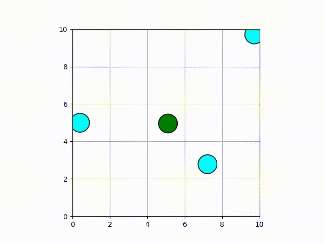
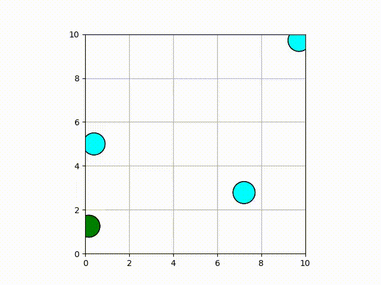
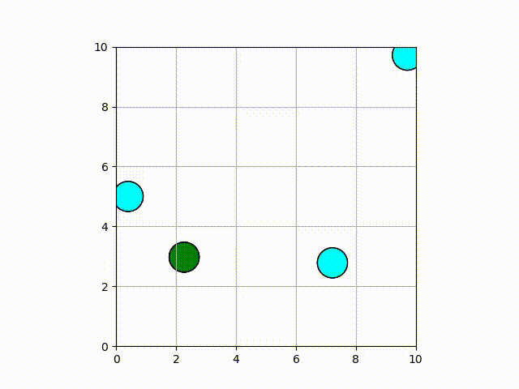
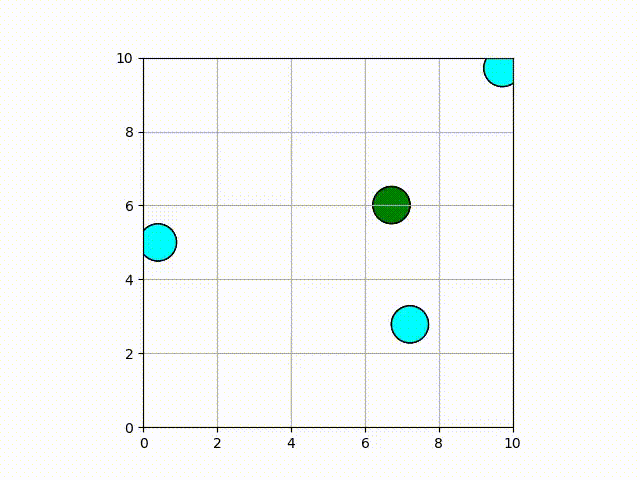

# Pathfinding Algorithm Visualizer

## A* algorithm 

A* is a widely used pathfinding algorithm in computer science and is particularly efficient in finding the shortest path between nodes on a weighted graph.

### Project Overview

This project was developed to implement the A* pathfinding algorithm as part of a larger effort in autonomous navigation for robots. The A* algorithm plays a crucial role in determining the optimal path for a robot to navigate from one point to another while avoiding obstacles.

### Getting Started

To run the A* pathfinding algorithm visualizer, ensure you have Python installed on your system. Additionally, you need to have Pygame installed. You can install Pygame using pip:
```
pip install pygame
```

After installing Pygame, you can clone this repository using the following command:
```
git clone https://github.com/Varun-Ajith/path-planning.git
```

Navigate to the cloned directory: 

```
cd path-planning
```

Run the Python script: 

```
python Path_planning.py
```

### Instructions
- Left-click on any empty grid square to place the starting node.
- Left-click on another empty grid square to place the ending node.
- Left-click and drag to create barriers.
- Right-click on a placed node to remove it.
- Press the Spacebar to start the A* algorithm visualization.
- Press 'c' to clear the grid and reset.

### Videos

| **Sample video 1**                                       | **Sample video 2**                                       |
|--------------------------------------------------|--------------------------------------------------|
|                    |                    |


## Conflict-Based Search (CBS) Pathfinding Algorithm

This pathfinding algorithm implements a Conflict-Based Search (CBS) algorithm for multi-agent pathfinding, along with a low-level A* search. The implementation includes features such as conflict resolution, admissible heuristics, and support for vertex and edge constraints.

### Features

- **A* Search**: A low-level pathfinding algorithm that efficiently finds the shortest path for each agent.
- **CBS Algorithm**: A high-level conflict resolution algorithm that ensures paths for multiple agents are collision-free.
- **Dynamic Constraints**: Supports vertex and edge constraints for flexible pathfinding.
- **Custom Environment**: A grid-based environment where agents navigate around obstacles to reach their goals.

### How It Works

1. **Environment Setup**:
   - Define the grid dimensions, agents' start and goal positions, and obstacles.
   - The environment handles constraints and validates states and transitions.

2. **Low-Level Search**:
   - The `AStar` class is used for finding the shortest path for an individual agent within the constraints.

3. **Conflict Resolution**:
   - The `CBS` algorithm resolves conflicts between agents (vertex or edge conflicts) by dynamically adding constraints and re-computing paths.

4. **Output**:
   - The algorithm generates a collision-free path for each agent and computes the total cost.

### Key Classes

#### `AStar`
Implements the A* search algorithm:
- **Methods**:
  - `search(agent_name)`: Finds the shortest path for a given agent.
  - `reconstruct_path(came_from, current)`: Reconstructs the path from the start to the goal.

#### `CBS`
Implements the CBS algorithm:
- **Methods**:
  - `search()`: Resolves conflicts and generates collision-free paths for all agents.
  - `generate_plan(solution)`: Converts the solution into a readable plan.

#### `Environment`
Handles the grid, agents, and constraints:
- **Methods**:
  - `get_neighbors(state)`: Returns valid neighboring states for a given state.
  - `create_constraints_from_conflict(conflict)`: Generates constraints based on detected conflicts.

### Installation
1. Clone the repository:
```
git clone https://github.com/Varun-Ajith/path-planning.git
cd centralized/cbs
```
2. Then run the following command on terminal:
```
python3 cbs.py input.yaml output.yaml
```
3. To visualize the generated result:
```
 python3 ../visualize.py input.yaml output.yaml
```

### Requirements
- Python 3.x: This code is designed to run on Python 3. Make sure you have Python 3 installed.

### Videos
1. Test 1:  Successful trial of cbs /  No conflict.
2.  Failed trial of cbs/occurence of conflict.


| **Test 1**                                                               | **Test 2**                                                                       |
|--------------------------------------------------------------------------|----------------------------------------------------------------------------------|
|                  |                      |


## Velocity Obstacle

This section of the project implements a decentralized obstacle avoidance system for multi-robot navigation using the Velocity Obstacle (VO) algorithm. Each robot autonomously avoids obstacles and other robots while moving toward its goal.

### Features

   - Real-time multi-robot navigation in a shared environment.
   - Collision avoidance using the Velocity Obstacle algorithm.
   - Dynamic visualization of robots, obstacles, and their paths using `matplotlib`.
   - Configurable simulation parameters.


### How It Works

1. Environment Setup:
   - Robots and obstacles are initialized with positions and velocities.
   - The simulation calculates paths dynamically based on VO constraints.

2. Velocity Obstacle Algorithm:
   - Each robot evaluates potential collisions and adjusts its velocity vector to avoid obstacles.

3. Visualization:
   -The simulation displays robots (green), obstacles (aqua), and the robot's goal direction (red dashed line).

### Installation

   1. Clone the repository:
      ```
      git clone https://github.com/Varun-Ajith/path-planning.git
      cd decentralized/
      ```
   2. Install dependencies:
      ```
      pip install numpy matplotlib
      ```
   3. Run and save the simulation:
      ```
      python3 decentralized.py -f velocity_obstacle/velObs.avi -m velocity_obstacle
      ```
### Visualization

   - Green circle: Robot.
   - Aqua circles: Obstacles.
   - Red dashed line: Goal direction.
   - Blue dashed line: Robot's path.

### Requirements
- Python 3.x: This code is designed to run on Python 3. Make sure you have Python 3 installed.

### Simulation parameters

| Argument | Description                                          |
|----------|------------------------------------------------------|
| `-m`     | Simulation mode (`velocity_obstacle`)                |
| `-f`     | Filename to save the simulation (e.g., `output.mp4`) |

     
### Videos
1. Test 1: The robot tries to stay at (5, 5), while avoiding collisions with the dynamic obstacles.
2. Test 2: The robot moves from (0, 1) to (7, 8), while avoiding obstacles.

| **Test 1**                                       | **Test 2**                                       |
|--------------------------------------------------|--------------------------------------------------|
|                             |                             |


## Non-linear Model predictive control
This module implements Nonlinear Model Predictive Control (NMPC) for advanced path planning and motion control. NMPC optimizes a robot's trajectory in real-time by solving a nonlinear optimization problem, considering both the dynamics of the system and environmental constraints.

### Features

- Solves nonlinear optimization problems in real-time to compute the optimal control input.
- Supports user-defined constraints, such as state and input bounds, obstacle avoidance, and path smoothness.
- Incorporates nonlinear system dynamics for accurate control.
- Predicts future states over a finite time horizon and adjusts controls iteratively.

### How it work

1. **System model**: Define the nonlinear system model using differential equations. The model can represent robot kinematics or dynamics, such as differential drive or 6-DoF motion.
2. **Optimizaation problem**: At each time step, NMPC solves an optimization problem that minimizes a cost function while respecting constraints.
3. **Receeding horizon**: NMPC uses a moving time horizon. The solution provides the control inputs for the current time step, and the horizon shifts forward as the simulation progresses.
4. **Collision Avoidance**: Obstacle positions and trajectories are considered as dynamic constraints within the optimization problem.
5. **Visualization**: Simulated robot trajectories and control inputs are visualized in real-time using `matplotlib`.

### Installation
1. Clone the repository :
   ```
   git clone https://github.com/Varun-Ajith/path-planning.git
   cd decentralized/nlmpc
   ```
2. Install dependencies :
   ```
   pip install matplotlib scipy numpy
   ```
3. Run the simulation :
   ```
   python3 decentralized.py -m nmpc
   ```
4. To save the simulation video (Optional) :
   ```
   python3 decentralized.py -f nlmpc/nmpc.avi -m nmpc
   ```
### Visualization

- Predicted Trajectories: Displayed as a dashed line.
- Robot Position: Current position of the robot is shown as a marker.
- Obstacle Constraints: Represented as shaded regions or dynamic marker.

### Videos

1. Test 1: The robot tries to move from (2, 3) to (4, 5, while avoiding collisions with the dynamic obstacles.
2. Test 2: The robot moves from (7, 6) to (5, 5), while avoiding obstacles.

| **Test 1**                                       | **Test 2**                                       |
|--------------------------------------------------|--------------------------------------------------|
|                             |                             |


## License
This project is licensed under the MIT License - see the [LICENSE](LICENSE) file for details.

## Acknowledgments
Special thanks to the developers of Pygame and matplotlib for providing a simple and intuitive framework for creating games and simulations in Python.

Feel free to contribute to this project by forking and submitting a pull request! If you encounter any issues or have suggestions for improvement, please open an issue.
